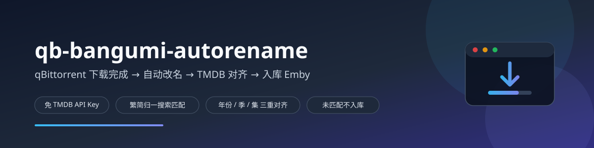
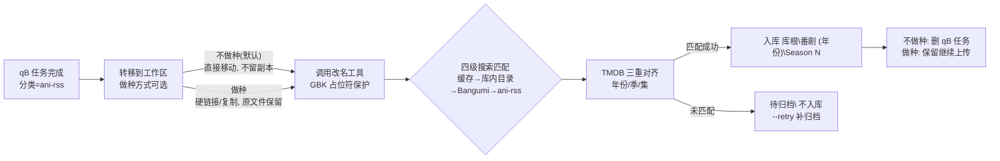
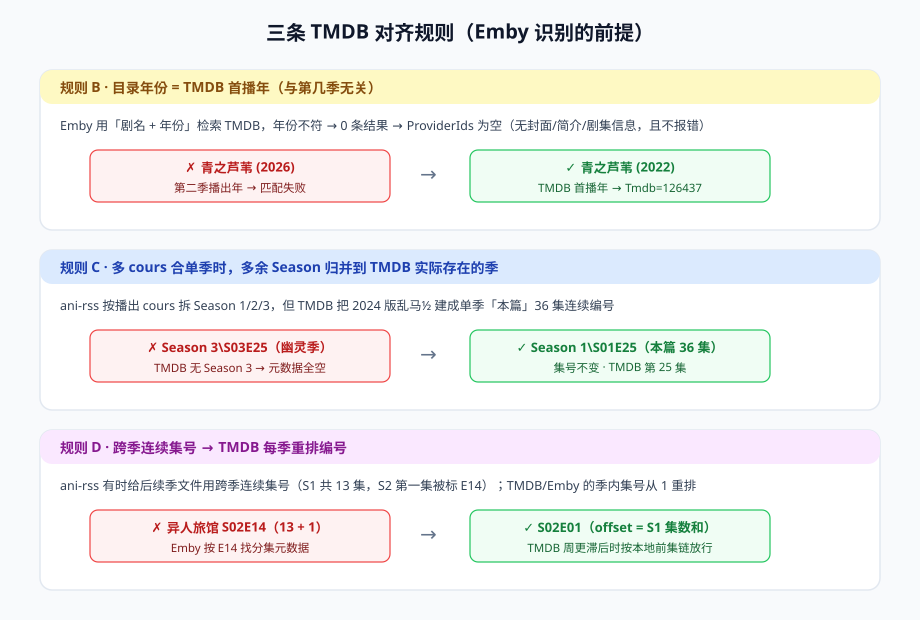

<div align="center">



**qBittorrent 下载完成 → 自动改名 → TMDB 对齐 → 入库 Emby 媒体库**

一站式番剧自动化归档：无需 TMDB API Key，繁简归一搜索匹配，年份/季/集三重 TMDB 对齐，匹配不到绝不入库。

  

</div>

---

## 背景

用 ani-rss + qBittorrent 自动追番时，下载完成的文件名五花八门，直接丢进媒体库 Emby 经常识别失败或元数据残缺。本项目把「改名 → 匹配 → 入库」整条链路自动化，并解决了三个最隐蔽的坑（都来自真实翻车现场）：

1. **目录年份写错** → Emby 检索 TMDB 返回 0 条，条目退化为无元数据（`ProviderIds` 为空，且不报错）
2. **多 cours 被拆成多个 Season** → TMDB 把它们合成单季连续编号，多余的 Season 成为「幽灵季」
3. **跨季连续集号** → TMDB/Emby 的季内集号从 1 重排，`S02E14` 其实是 `S02E01`

## 工作流程



<div align="center"></div>

## 特性

- **做种方式可选**：`QBR_TRANSFER_MODE="no_seed"`（默认，直接移动不留副本）或 `"seed"`（硬链接/复制，下载目录原文件保留继续做种，入库后不动 qB 任务）；命令行 `--seed` / `--no-seed` 可临时覆盖
- **免 TMDB API Key**：经 Emby 服务端的 `RemoteSearch` 反查 TMDB 首播年与季结构
- **四级搜索匹配制**：缓存 → 库内已有目录（繁简/标点/年份归一）→ Bangumi API 规范名对齐 → ani-rss 目录名回退；**匹配不到就不入库**，绝不猜测建目录
- **多库根支持**：E/F 等多个媒体库根全部搜索，同一部番不因「库里有但没搜到」而分叉
- **年份/季/集三重 TMDB 对齐**（详见下方规则）
- **同名不同版分离**：重制版 vs 旧版（如乱马½ 1989/2024）按年份距离拒配，绝不错归
- **冲突安全**：同名同大小去重；不同大小先备份旧文件再入库，绝不覆盖
- **GBK 占位符保护**：文件名含 `½`/`♪`/`☆` 等字符时改名工具（PyInstaller 固化 GBK 输出）会崩溃，自动占位替换后还原
- **失败安全**：改名工具失败 → 整个工作区保留现场；全程日志 + `failures.jsonl`
- **演练模式**：`--dry-run` 用硬链接仿真，不动真实文件

## TMDB 对齐规则

| 规则 | 问题场景 | 处理 |
|---|---|---|
| **B · 年份** | 目录年份 = 第二季播出年（如 `青之芦苇 (2026)`） | 改为 TMDB 首播年 `(2022)`，同步改写 `tvshow.nfo` |
| **C · 季归并** | ani-rss 按 cours 拆 S1/S2/S3，TMDB 单季连续编号（如 2024 版乱马½「本篇」36 集） | `Season 3\S03E25` → `Season 1\S01E25`（集号不变） |
| **D · 集号重排** | ani-rss 跨季连续集号（S1 共 13 集，S2 第一集标 `S02E14`） | 改写为 `S02E01`（offset = 前几季集数和；TMDB 周更滞后时按本地前集链放行） |

另有规则 A：库内已有同一部番（即使译名/年份不同）时，新一季对齐既有目录，绝不另建分叉目录。

## 安装

```bash
git clone https://github.com/DaisySG297/qb-bangumi-autorename.git
pip install zhconv   # 繁简转换（也可放到脚本同目录 _vendor/ 下）
```

**自备改名工具**：本项目驱动一个独立的番剧批量改名 CLI（PyInstaller 打包，只扫描其工作目录、执行前从 stdin 读入 `y` 确认），将其路径配置到 `QBR_RENAME_EXE`。该工具见姊妹仓库 [bangumi-rename-for-emby](https://github.com/DaisySG297/bangumi-rename-for-emby)。

## 配置

全部通过环境变量（前缀 `QBR_`），无配置文件依赖：

| 环境变量 | 默认值 | 说明 |
|---|---|---|
| `QBR_RENAME_EXE` | `C:\Tools\番剧批量重命名(字幕版).exe` | 第三方改名工具路径 |
| `QBR_LIBRARY_DIRS` | `D:\Media\Bangumi` | 媒体库根目录，**多个用 `\|` 分隔** |
| `QBR_STAGE_DIR` | 脚本所在目录 | 暂存根目录（ani-rss 下载目录） |
| `QBR_QB_HOST` | `http://127.0.0.1:8080` | qBittorrent WebUI 地址 |
| `QBR_QB_APIKEY` | （空） | qB WebUI API Key（删除种子需要） |
| `QBR_EMBY_HOST` | （空） | Emby 服务器地址，如 `http://192.168.1.10:8096` |
| `QBR_EMBY_APIKEY` | （空） | Emby API Key |
| `QBR_CATEGORY` | `ani-rss` | 只处理该分类的种子 |
| `QBR_TRANSFER_MODE` | `no_seed` | 转移方式：`no_seed`=不做种，直接移动不留副本；`seed`=做种，硬链接/复制保留原文件 |
| `QBR_SEED_ACTION` | `delete` | 仅不做种模式生效：入库后删除 qB 种子任务（`pause` 暂停 / `keep` 不动）；做种模式下忽略，任务一律保留 |

## qBittorrent 触发配置

> 设置 → 下载 → 「Torrent 完成时运行外部程序」：

```
pythonw.exe C:\path\to\qb_rename_move.py "%N" "%F" "%D" "%L" "%G" "%I"
```

⚠️ **占位符陷阱**（qB 5.x 实测）：`%L` 是**分类**、`%G` 是标签；`%C` 是文件数不是分类。传错了会静默跳过、什么都不发生。

## 使用

```bash
python qb_rename_move.py            # qB autorun 正常入口
python qb_rename_move.py --retry    # 重扫 待归档\ 目录补归档（建议挂每日计划任务）
python qb_rename_move.py --dry-run  # 演练：工作区用硬链接，不动真实文件
python qb_rename_move.py --seed     # 本次运行强制做种（硬链接/复制，保留下载目录原文件）
python qb_rename_move.py --no-seed  # 本次运行强制不做种（直接移动，不留副本）
```

## 命名规则总览

1. **规则 A · 目录对齐**：库内已有同一部番（繁简/译名/年份归一后匹配）→ 沿用既有目录
2. **规则 B · 年份 = TMDB 首播年**：不符则自动改名目录 + 改写 `tvshow.nfo` 的 `<year>`
3. **规则 C · 季归并**：文件季号不在 TMDB 季列表中 → 归并到 TMDB 实际存在的季
4. **规则 D · 集号重排**：跨季连续集号 → 按 TMDB 每季重排编号改写
5. **同名不同版分离**：与该季播出年相差超 5 年的既有目录不匹配（重制版另建目录）
6. **未匹配不入库**：文件进 `待归档\`，目标目录出现后 `--retry` 自动补归档

## 常见问题

**Emby 里某番剧没封面/没简介？**
大概率是年份/季/集与 TMDB 不对齐导致匹配失败。用 Emby API 查该条目 `ProviderIds` 是否为空，对照上方三规则修正目录名与 `tvshow.nfo`，再对条目执行 `Refresh`（`ReplaceAllMetadata: true`）。

**qB 配置了 autorun 但不触发？**
检查配置段层级（qB 5.x 必须是顶层 `[AutoRun]` 段，写进 `[Preferences]` 下会静默失效）和占位符含义（`%L`=分类）。用 WebUI API `setPreferences` 写入并回读验证最可靠。

**改名工具对特殊字符报 `UnicodeEncodeError`？**
工具以 GBK 打印预览，`½`/`♪` 等超集字符必崩（`PYTHONUTF8` 无效）。本脚本已内置占位符机制自动处理。

## 鸣谢

本项目的诞生站在这些优秀项目/服务的肩膀上，特别感谢：

- **[ani-rss](https://github.com/wushuo894/ani-rss)** —— 基于 RSS 自动追番/订阅/下载/刮削，链路的上游触发源
- **[qBittorrent](https://www.qbittorrent.org/)** 及其 WebUI API —— 下载与完成事件触发
- **[Emby](https://emby.media/)** —— 媒体库与其 `RemoteSearch` 接口（本项目免 Key 反查 TMDB 的关键）
- **[Bangumi API](https://github.com/bangumi/api)** (bgm.tv) —— 条目规范名与别名解析
- **[TMDB](https://www.themoviedb.org/)** —— 剧集首播年/季结构/每季集数的权威数据源
- **[zhconv](https://pypi.org/project/zhconv/)** —— 中文繁简转换，搜索匹配归一的基础
- **各汉化字幕组 / 压制组** —— 番剧中文字幕与压制资源的源头，本链路处理的正是他们的劳动成果

## 开源协议

本项目基于 [MIT License](LICENSE) 开源，欢迎自由使用、修改与分发。

<div align="center">

**如果这个工具对你有帮助，欢迎点一个 ⭐ Star 支持一下！**

</div>
