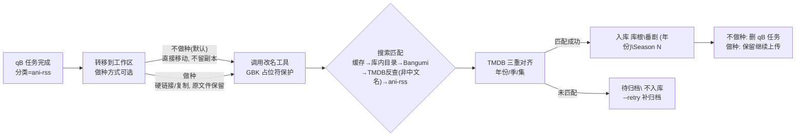

<div align="center">


**qBittorrent 下载完成 → 自动改名 → TMDB 对齐 → 入库 Emby 媒体库**

一站式番剧自动化归档：无需 TMDB API Key，繁简归一搜索匹配，年份/季/集三重 TMDB 对齐，匹配不到绝不入库。

  

</div>

---

## 背景

用 ani-rss + qBittorrent 自动追番时，下载完成的文件名五花八门，直接丢进媒体库 Emby 经常识别失败或元数据残缺。本项目把「改名 → 匹配 → 入库」整条链路自动化，并解决了三个最隐蔽的坑（都来自真实翻车现场）：

1. **目录年份写错** → Emby 检索 TMDB 返回 0 条，条目退化为无元数据（`ProviderIds` 为空，且不报错）
2. **多 cours 被拆成多个 Season** → TMDB 把它们合成单季连续编号，多余的 Season 成为「幽灵季」
3. **跨季连续集号** → TMDB/Emby 的季内集号从 1 重排，`S02E14` 其实是 `S02E01`

## 工作流程



<div align="center"></div>

## 特性

- **做种方式可选**：`QBR_TRANSFER_MODE="no_seed"`（默认，直接移动不留副本）或 `"seed"`（硬链接/复制，下载目录原文件保留继续做种，入库后不动 qB 任务）；命令行 `--seed` / `--no-seed` 可临时覆盖
- **主/备组角色感知**：同集已有其他字幕组版本时，按 ani-rss 订阅的主组/备组自动路由——主组替换备组、备组遇主组直接丢弃，不再盲去重
- **四级冲突裁决**：① 订阅主/备组角色 → ② 全局组优劣表（`GROUP_PREFERRED` 优选 / 未评级 / `GROUP_DEPRIORITIZED` 次选）→ ③ 同组新版（v2 修复版重发布）整套替换 → ④ 同大小去重 / 不同大小旧版移冲突备份
- **免 TMDB API Key**：经 Emby 服务端的 `RemoteSearch` 反查 TMDB 首播年与季结构
- **搜索匹配制**：缓存 → 库内已有目录（繁简/标点/年份归一）→ Bangumi API 规范名对齐 → **TMDB 反查兜底（仅非中文标题：中文名二次反查，可新建目录）** → ani-rss 目录名回退；全都没命中就不入库，不瞎猜
- **多库根支持**：E/F 等多个媒体库根全部搜索，同一部番不因「库里有但没搜到」而分叉
- **NSFW 库根参与匹配**（`QBR_NSFW_LIBRARY_DIRS`）：既有目录匹配覆盖独立 NSFW 媒体库，订阅更新不再误建到普通番剧库（避免同一部番出现两个 Emby 条目）
- **年份/季/集三重 TMDB 对齐** + **季归属手工覆写**（`SEASON_OVERRIDES`，详见下方规则）
- **绝对集号续排**（`ep_offset`）：TMDB 把多期合并成一个超长 Season 时（如 东京复仇者 S1 共 55 集），续作 `E01/E02` 自动续排为 `S01E51/E52`
- **同名不同版分离**：重制版 vs 旧版（如乱马½ 1989/2024）按年份距离拒配，绝不错归
- **冲突安全**：任何冲突都不覆盖，旧版本移入 `冲突备份\<时间戳>[_原因]\`
- **GBK 占位符保护**：文件名含 `½`/`♪`/`☆` 等字符时旧版改名工具（PyInstaller 固化 GBK 输出）会崩溃，脚本自动占位替换后还原（改名工具 **v1.1** 起已自行把输出流降级为 `errors=replace`，此处保留为双保险）
- **英文点分(scene)发布名支持**：`Now.That.I...Girls.S01E01.1080p....MSubs-ToonsHub.mkv` 这类「无 `[组]` 前缀、组名在结尾、标题点分、集号 `SxxExx` 点分夹中段」的外站发布名，改名前**主动预改写**为 `[组] 标题 - SxxEyy.ext`（保留季号）；万一仍失败，再按 qB 任务名预改写重试一次（改名工具 **v1.1** 起已原生识别该形态，预改写对旧版工具同样兜得住）
- **TMDB 反查兜底建目录**：非中文发布名 Bangumi 多半「查不到/置信度不足」→ 用 TMDB 反查，并利用「Emby RemoteSearch 按**查询语种**决定返回名语种」的特性做**中文名二次反查**（英文名→原始语种名→中文名），先对齐库内既有目录，否则新建 `<中文名> (TMDB 首播年)`
- **标题残留清理**：剔除改名工具拼进标题的发布碎片（`... 01v2AVC - S01E01` → `... - S01E01`）
- **日志按天分段**：`logs/rename_move_YYYY-MM-DD.log`，文件内再按「一次运行」分段；超 2MB 滚动、超 30 天自动清理
- **钉钉通知（可选）**：每次运行汇总为**一条**卡片（成功/跳过/失败/重试 + WARN/ERROR 明细），支持加签
- **失败安全**：改名工具失败 → 整个工作区保留现场；全程日志 + `failures.jsonl`
- **演练模式**：`--dry-run` 用硬链接仿真，不动真实文件

## TMDB 对齐规则

| 规则 | 问题场景 | 处理 |
|---|---|---|
| **B · 年份** | 目录年份 = 第二季播出年（如 `青之芦苇 (2026)`） | 改为 TMDB 首播年 `(2022)`，同步改写 `tvshow.nfo` |
| **C · 季归并** | ani-rss 按 cours 拆 S1/S2/S3，TMDB 单季连续编号（如 2024 版乱马½「本篇」36 集） | `Season 3\S03E25` → `Season 1\S01E25`（集号不变） |
| **D · 集号重排** | ani-rss 跨季连续集号（S1 共 13 集，S2 第一集标 `S02E14`） | 改写为 `S02E01`（offset = 前几季集数和；TMDB 周更滞后时按本地前集链放行） |
| **E · 手工覆写** | Emby 侧 TMDB 季数据滞后 / 季名匹配无命中（如 网球王子 U-17 → S3、桃源暗鬼 日光篇 → S2） | `SEASON_OVERRIDES` 配置级权威兜底：强制归入指定季 |
| **E+ · 绝对集号续排** | 续作并入 TMDB 合并单季（如 东京复仇者 三天战争篇，TMDB S1 共 55 集，库内已排到 E50） | 条目加 `ep_offset: 50` → `E01/E02` 续排为 `S01E51/E52` |

另有规则 A：库内已有同一部番（即使译名/年份不同）时，新一季对齐既有目录，绝不另建分叉目录。

### SEASON_OVERRIDES 配置示例

```python
SEASON_OVERRIDES = [
    {"show": ["新网球王子 U-17世界杯篇"],           # 子串命中库目录名
     "file": ["世界杯决赛成员决定战", "決勝メンバー決定戦", ...],  # 子串命中原始文件名/qB 任务名
     "season": 3},
    {"show": ["东京复仇者"],                        # 续作并入合并单季
     "file": ["三天战争篇", "santen sensou", "three titans"],
     "season": 1,
     "ep_offset": 50},                          # 绝对集号续排: E01/E02 -> S01E51/E52
]
```

`show` 与 `file` **同时**命中才生效（t2s + 去标点归一化后比对），命中后覆盖此前一切季推断；未命中完全不影响原流程。原始文件名在改名工具运行前以 `(大小, mtime)` 为键截获。

## 同集冲突：主/备组角色路由

配好 ani-rss 后（见配置表 `QBR_ANIRSS_*`），同一集出现**不同字幕组**版本时按订阅角色自动路由：

| 情形 | 处理 |
|---|---|
| 新文件 = **主组**，库内 = 备组 | 主组替换：旧备组**整套**（视频 + nfo + 封面/缩略图）移入 `冲突备份\<时间戳>_主组替换备组\`，新文件正常入库 |
| 新文件 = **备组**，库内 = 主组 | 备组文件**直接丢弃**（连同工作区同前缀配套文件），不产生重复副本 |
| 两侧同为备组 / 角色不明 | **全局组优劣表**裁决：优选组（`GROUP_PREFERRED`）> 未评级 > 次选组（`GROUP_DEPRIORITIZED`），更优者整套替换 |
| 同组、文件名不同、大小不同 | **同组新版**（同一字幕组 v2 修复版重发布）→ 整套替换，旧版移入 `冲突备份\<时间戳>_同组新版\` |
| 仍无法裁决 | 同大小去重丢弃；不同大小新文件移入 `冲突备份\<时间戳>\`（库内保留旧的） |

**字幕组别名折叠**：ani-rss 存的是**显示名**（如 `三明治摆烂组`、`喵萌奶茶屋`、`桜都字幕组`），而入库文件名里是**发布标签**（如 `smzase`、`Nekomoe kissaten`、`Sakurato`），文本不同。脚本内置 `GROUP_ALIASES` 对照表把两侧折叠到同一规范名，主/备判定才生效；遇到新组名时往表里补一行即可。

未配置 ani-rss（`QBR_ANIRSS_HOST` 为空）时静默退回通用冲突规则，功能不受影响。

## 安装

```bash
git clone https://github.com/DaisySG297/qb-bangumi-autorename.git
pip install zhconv   # 繁简转换（也可放到脚本同目录 _vendor/ 下）
```

**自备改名工具**：本项目驱动一个独立的番剧批量改名 CLI（PyInstaller 打包，只扫描其工作目录、执行前从 stdin 读入 `y` 确认），将其路径配置到 `QBR_RENAME_EXE`。该工具见姊妹仓库 [bangumi-rename-for-emby](https://github.com/DaisySG297/bangumi-rename-for-emby)，成品 EXE 见 [Releases](https://github.com/DaisySG297/bangumi-rename-for-emby/releases/latest)（`bangumi-rename-v1.1.exe`）。建议使用 **v1.1 及以上**：该版原生支持外站英文点分发布名，并修掉了「工作区混有无法识别的文件时 GBK 打印崩溃、确认后一个文件都没改」的老问题。

## 配置

全部通过环境变量（前缀 `QBR_`），无配置文件依赖：

| 环境变量 | 默认值 | 说明 |
|---|---|---|
| `QBR_TOOLS_DIR` | 脚本所在目录 | 工具目录：脚本 / 改名 exe / 日志 / 工作区 / 依赖集中于此，与下载暂存区**严格分开** |
| `QBR_RENAME_EXE` | `<工具目录>\番剧批量重命名(字幕版).exe` | 第三方改名工具路径 |
| `QBR_LIBRARY_DIRS` | `D:\Media\Bangumi` | 媒体库根目录，**多个用 `\|` 分隔**；第一个根用于新建目录 |
| `QBR_NSFW_LIBRARY_DIRS` | （空） | 额外参与**既有目录匹配**的库根（如独立 NSFW 媒体库），多个用 `\|` 分隔；新建目录不落这里 |
| `QBR_CONFLICT_DIR` | `<工具目录父级>\MediaConflictBackup` | 冲突备份根目录（**勿放在 Emby 库根内**，否则会被索引成幽灵条目） |
| `QBR_STAGE_DIR` | `<工具目录父级>\下载暂存` | 暂存根目录（ani-rss 下载目录），处理完应只剩下载内容 |
| `QBR_QB_HOST` | `http://127.0.0.1:8080` | qBittorrent WebUI 地址 |
| `QBR_QB_APIKEY` | （空） | qB WebUI API Key（删除种子需要） |
| `QBR_EMBY_HOST` | （空） | Emby 服务器地址，如 `http://192.168.1.10:8096` |
| `QBR_EMBY_APIKEY` | （空） | Emby API Key |
| `QBR_CATEGORY` | `ani-rss` | 只处理该分类的种子 |
| `QBR_ANIRSS_HOST` | （空） | ani-rss 地址，如 `http://192.168.1.10:7789`；配置后启用主/备组角色识别 |
| `QBR_ANIRSS_KEY` | （空） | ani-rss 的 apiKey（WebUI 设置页可见，请求头 `X-Api-Key`） |
| `QBR_TRANSFER_MODE` | `no_seed` | 转移方式：`no_seed`=不做种，直接移动不留副本；`seed`=做种，硬链接/复制保留原文件 |
| `QBR_SEED_ACTION` | `delete` | 仅不做种模式生效：入库后删除 qB 种子任务（`pause` 暂停 / `keep` 不动）；做种模式下忽略，任务一律保留 |
| `QBR_DINGTALK_WEBHOOK` | （空） | 钉钉群自定义机器人 Webhook（填了才启用通知） |
| `QBR_DINGTALK_SECRET` | （空） | 加签密钥（`SEC` 开头，安全设置选「加签」时填） |
| `QBR_DINGTALK_ENABLED` | 有 Webhook 时为 `true` | 总开关 |
| `QBR_DINGTALK_KEYWORD` | `番剧入库` | 消息标题关键词（安全设置选「自定义关键词」时配套） |
| `QBR_DINGTALK_AT_ALL` | `false` | 是否 @所有人 |
| `QBR_BGM_UA` | `qb-bangumi-autorename/1.0` | 请求 Bangumi API 的 User-Agent |

## qBittorrent 触发配置

> 设置 → 下载 → 「Torrent 完成时运行外部程序」：

```
pythonw.exe C:\path\to\qb_rename_move.py "%N" "%F" "%D" "%L" "%G" "%I"
```

⚠️ **占位符陷阱**（qB 5.x 实测）：`%L` 是**分类**、`%G` 是标签；`%C` 是文件数不是分类。传错了会静默跳过、什么都不发生。

## 使用

```bash
python qb_rename_move.py            # qB autorun 正常入口
python qb_rename_move.py --retry    # 重扫 待归档\ 目录补归档（建议挂每日计划任务）
python qb_rename_move.py --dry-run  # 演练：工作区用硬链接，不动真实文件
python qb_rename_move.py --seed     # 本次运行强制做种（硬链接/复制，保留下载目录原文件）
python qb_rename_move.py --no-seed  # 本次运行强制不做种（直接移动，不留副本）
```

## 命名规则总览

1. **规则 A · 目录对齐**：库内已有同一部番（繁简/译名/年份归一后匹配）→ 沿用既有目录
2. **规则 B · 年份 = TMDB 首播年**：不符则自动改名目录 + 改写 `tvshow.nfo` 的 `<year>`
3. **规则 C · 季归并**：文件季号不在 TMDB 季列表中 → 归并到 TMDB 实际存在的季
4. **规则 D · 集号重排**：跨季连续集号 → 按 TMDB 每季重排编号改写
5. **同名不同版分离**：与该季播出年相差超 5 年的既有目录不匹配（重制版另建目录）
6. **未匹配不入库**：走完「缓存 → 库内已有目录 → Bangumi 规范名对齐 → **TMDB 反查兜底（非中文名）** → ani-rss 目录名」仍未命中，文件才进 `待归档\`，目标目录出现后 `--retry` 自动补归档
7. **规则 E · 手工覆写**：`SEASON_OVERRIDES`（季归属）+ `ep_offset`（绝对集号续排），自动裁决不动时的配置级兜底

## 常见问题

**Emby 里某番剧没封面/没简介？**
大概率是年份/季/集与 TMDB 不对齐导致匹配失败。用 Emby API 查该条目 `ProviderIds` 是否为空，对照上方三规则修正目录名与 `tvshow.nfo`，再对条目执行 `Refresh`（`ReplaceAllMetadata: true`）。

**qB 配置了 autorun 但不触发？**
检查配置段层级（qB 5.x 必须是顶层 `[AutoRun]` 段，写进 `[Preferences]` 下会静默失效）和占位符含义（`%L`=分类）。用 WebUI API `setPreferences` 写入并回读验证最可靠。

**改名工具对特殊字符报 `UnicodeEncodeError`？**
旧版工具以 GBK 打印预览，`½`/`♪` 等超集字符必崩（`PYTHONUTF8` 无效）。本脚本已内置占位符机制自动处理；改名工具 **v1.1** 起也把输出流降级为 `errors=replace`，两版都不会再崩。

**任务失败提示「改名工具无法识别工作区中的任何文件」？**
原始文件名是工具解析不了的形态，两类都已自动处理：
- **英文点分(scene)发布名**（`Now.That.I...Girls.S01E01.1080p....MSubs-ToonsHub.mkv`：组名在结尾、标题点分）：改名前就预改写为 `[组] 标题 - SxxEyy.ext`（**季号保留**，工具认 `- S02E05`），可直接识别（该形态改名工具 **v1.1** 起也已原生支持）；
- **其他不可解析形态**：按 qB 任务名预改写为 `[组] 标题 - NN.ext` 后自动重试一次。

若任务里有多个视频文件（无法逐集对号）则不救援，工作区保留在 `_残留待处理\_改名失败_*` 供人工处理。

**英文标题的番搜不到目标目录、进了 `待归档\`？**
点分名发布的标题通常是**英文**，Bangumi 侧容易「有结果但置信度不足」。脚本用 TMDB 反查兜底：先按英文名查一次（TMDB 对英文查询返回**原始语种名**），再用该名查第二次拿**中文名**，然后对齐库内既有目录或新建 `<中文名> (<TMDB 首播年>)`。若该番属于另一个媒体库（如 NSFW 库），在那个库内**预建同名目录**（可放含 `<tmdbid>` 的 `tvshow.nfo`）即可——脚本会自动对齐过去，而不是新建分叉目录。

**新一季是独立 Bangumi 条目（ani-rss 按 S01 编号），但 TMDB 是合并单季，集号对不上？**
在 `SEASON_OVERRIDES` 加一条：`{"show": [...], "file": [...], "season": N}`；若该季在 TMDB 上续排在超长 Season 里（如第 4 期续排进 S1 第 51 集起），再加 `"ep_offset": 50`。`file` 关键字要能命中原始文件名或 qB 任务名。

## 更新记录

| 版本 | 变更 |
|---|---|
| v24 | **外站英文点分(scene)发布名全链路支持**：`parse_scene_dot_name` 解析点分名（组名在结尾 / 标题点分 / `SxxExx` 夹中段，`MSubs-ToonsHub`→`ToonsHub`）+ 改名前**主动预改写**（保留季号）+ 目录匹配新增 **TMDB 反查兜底**（中文名二次反查） |
| v23 | **改名工具兜底救援**（英文点分名自动预改写重试）+ **`ep_offset` 绝对集号续排**（续作并入 TMDB 合并单季，东京复仇者 三天战争篇案例） |
| v22 | 修复 TMDB 单季合并结构下的**幽灵季**（乱马½ 2024 案例）：归并目标已有其他版本时一律归并，交由冲突路由处理 |
| v21 | **标题残留清理**：剔除改名工具拼进标题的发布碎片（`01v2AVC` 等） |
| v20 | `SEASON_OVERRIDES` 增加桃源暗鬼（日光·華嚴瀑布篇 = TMDB S2） |
| v19 | 同集冲突新增裁决三：**同组新版替换**（同一字幕组 v2 修复版重发布） |
| v18 | **集号守卫**（qB 任务名集号权威，防 `U-17` 被当集号）+ **季归属手工覆写** `SEASON_OVERRIDES`（网球王子 U-17 案例） |
| v17 | 全局组优劣表启用条件放宽：订阅给不出裁决（含两侧同为备组）即按「优选/未评级/次选」裁决 |
| v16 | **NSFW 库根参与既有目录匹配**，修复同一部番出现两个 Emby 条目（黑暗召唤师案例） |
| v15 | **日志按天分段** + 单日滚动 + 超期清理；文件内按「一次运行」再分段 |
| v14 | 修复 Bangumi 候选名末尾年份导致的**双层年份**（`(1994) (1994)`）与同名重制版错配 |
| v13 | **空目录清扫兜底**：后序递归删除「只含空子目录」的下载任务目录树 |
| v12 | **工具与下载分离**：脚本/exe/日志/工作区/依赖集中到工具目录，下载暂存区恢复纯净 |
| v11 | 修复 Emby 侧车后缀被当成伪组名导致的主/备误判；新增全局组优劣兜底 |
| v10 | 修复拉丁文标题置信度误配（`Black Clover` vs `BLACK LAGOON`）；长间隔正统续作经首播年仲裁 |
| v9 | 钉钉通知：每次运行汇总一条卡片 |

## 鸣谢

本项目的诞生站在这些优秀项目/服务的肩膀上，特别感谢：

- **[ani-rss](https://github.com/wushuo894/ani-rss)** —— 基于 RSS 自动追番/订阅/下载/刮削，链路的上游触发源
- **[qBittorrent](https://www.qbittorrent.org/)** 及其 WebUI API —— 下载与完成事件触发
- **[Emby](https://emby.media/)** —— 媒体库与其 `RemoteSearch` 接口（本项目免 Key 反查 TMDB 的关键）
- **[Bangumi API](https://github.com/bangumi/api)** (bgm.tv) —— 条目规范名与别名解析
- **[TMDB](https://www.themoviedb.org/)** —— 剧集首播年/季结构/每季集数的权威数据源
- **[zhconv](https://pypi.org/project/zhconv/)** —— 中文繁简转换，搜索匹配归一的基础
- **各汉化字幕组 / 压制组** —— 番剧中文字幕与压制资源的源头，本链路处理的正是他们的劳动成果
- **所有为本项目提出建议与反馈的朋友**

## 开源协议

本项目基于 [MIT License](LICENSE) 开源，欢迎自由使用、修改与分发。

<div align="center">

**如果这个工具对你有帮助，欢迎点一个 ⭐ Star 支持一下！**

</div>
